# Menu Service - Entity Relationship Diagram (ERD)

This document describes the database schema for the Menu Service, focusing on the core menu entities and their relationships. Approval/submission workflow tables are excluded.

## Database Schema Overview

The Menu Service uses **PostgreSQL** and the database name is `deliveryx_menu`.

### Core Concepts

1. **Menus** belong to Locations (one menu per location)
2. **Collections** organize products into categories (Pizzas, Desserts, etc.)
3. **Products** are created at the location level and can be reused across menus
4. **Menu Products** is the junction table linking products to specific collections within a menu
5. **Attribute Groups** define customization options (Size, Toppings, etc.)
6. **Attributes** are the individual options within a group (Small, Medium, Large)
7. **Sections** are dynamically created (not a table) - one section per collection

---

## Entity Relationship Diagram

```mermaid
erDiagram
    MENUS ||--o{ COLLECTIONS : "has many"
    MENUS ||--o{ MENU_PRODUCTS : "contains"
    COLLECTIONS ||--o{ MENU_PRODUCTS : "organizes"
    PRODUCTS ||--o{ MENU_PRODUCTS : "included in"
    PRODUCTS ||--o{ PRODUCT_ATTRIBUTE_GROUPS : "has"
    ATTRIBUTE_GROUPS ||--o{ ATTRIBUTES : "contains"
    ATTRIBUTE_GROUPS ||--o{ PRODUCT_ATTRIBUTE_GROUPS : "linked to"

    MENUS {
        uuid menu_id PK
        uuid location_id UK "Foreign key to Restaurant Service"
        enum status "draft, pending_review, approved, rejected"
        timestamp submitted_at
        timestamp reviewed_at
        text rejection_reason
        timestamp created_at
        timestamp updated_at
    }

    COLLECTIONS {
        uuid collection_id PK
        uuid menu_id FK
        varchar name "Enum: Pizzas, Burgers, Sides, Desserts, Drinks, etc."
        integer position "Display order"
        text image_url
        timestamp created_at
        timestamp updated_at
    }

    PRODUCTS {
        uuid product_id PK
        uuid location_id "Foreign key to Restaurant Service"
        varchar name
        text description
        decimal price "Must be > 0"
        varchar category
        text image_url
        boolean is_available "Default true"
        timestamp created_at
        timestamp updated_at
    }

    MENU_PRODUCTS {
        uuid menu_id PK,FK
        uuid product_id PK,FK
        uuid collection_id FK
        uuid section_id "Optional, for future use"
        integer position "Display order within collection"
        timestamp created_at
    }

    ATTRIBUTE_GROUPS {
        uuid id PK
        varchar name "e.g., Size, Toppings, Extras"
        integer min_selections "Default 0"
        integer max_selections "Default 1"
        boolean is_required "Default false"
        boolean system_defined "Default false"
        timestamp created_at
        timestamp updated_at
    }

    ATTRIBUTES {
        uuid id PK
        uuid attribute_group_id FK
        varchar name "e.g., Small, Medium, Large"
        decimal price_impact "Additional cost, default 0"
        boolean is_default "Default false"
        timestamp created_at
        timestamp updated_at
    }

    PRODUCT_ATTRIBUTE_GROUPS {
        uuid product_id PK,FK
        uuid attribute_group_id PK,FK
        timestamp created_at
    }
```



---

## Entity Descriptions

### 1. **menus**
- **Purpose:** Represents a draft or published menu for a location
- **Key Constraint:** One menu per location (UNIQUE on location_id)
- **Status Flow:** draft → pending_review → approved/rejected
- **Indexes:**
  - `location_id` (for lookups)
  - `status` (for filtering)

### 2. **collections**
- **Purpose:** Categories that organize products (e.g., "Pizzas", "Desserts")
- **Key Constraint:** Name must be one of 10 predefined values
- **Allowed Names:** Pizzas, Burgers, Sides, Desserts, Drinks, Salads, Breakfast, Sandwiches, Pasta, Seafood
- **Position:** Controls display order in menu
- **Cascade:** Deleted when parent menu is deleted
- **Indexes:**
  - `menu_id` (foreign key)
  - `position` (for ordering)

### 3. **products**
- **Purpose:** Individual menu items (location-scoped, reusable across menus)
- **Key Concept:** Products belong to locations, NOT menus
- **Why?** A location can have multiple menus over time (draft, approved versions), and products remain consistent
- **Price:** Must be greater than 0 (database constraint)
- **Availability:** Products can be marked unavailable without deletion
- **Indexes:**
  - `location_id` (for lookups)
  - `category` (for filtering)
  - `is_available` (for filtering)

### 4. **menu_products** (Junction Table)
- **Purpose:** Links products to specific collections within a menu
- **Composite Primary Key:** (menu_id, product_id) - a product can only appear once per menu
- **Position:** Controls display order of products within a collection
- **Section ID:** Currently optional, reserved for future multi-section support
- **Cascade:** Deleted when menu or product is deleted
- **Indexes:**
  - `menu_id` (foreign key)
  - `product_id` (foreign key)
  - `collection_id` (foreign key)
  - `(collection_id, position)` (for ordered retrieval)

### 5. **attribute_groups**
- **Purpose:** Defines groups of customization options (e.g., "Size", "Toppings")
- **Min/Max Selections:** Controls how many attributes can be selected
  - Example: Size (min=1, max=1) - must select exactly one
  - Example: Toppings (min=0, max=5) - optional, up to 5
- **System Defined:** True for pre-seeded groups (Size, Cuisson, Color)
- **Required:** If true, customer must select at least min_selections
- **Indexes:** `name`

### 6. **attributes**
- **Purpose:** Individual options within an attribute group
- **Price Impact:** Additional cost (positive or negative) when selected
- **Is Default:** If true, this option is pre-selected
- **Cascade:** Deleted when parent attribute group is deleted
- **Indexes:** `attribute_group_id` (foreign key)

### 7. **product_attribute_groups** (Junction Table)
- **Purpose:** Links products to attribute groups for customization
- **Example:** "Margherita Pizza" → Size group, Toppings group
- **Composite Primary Key:** (product_id, attribute_group_id)
- **Cascade:** Deleted when product or attribute group is deleted
- **Indexes:** Both foreign keys

---

## Key Relationships Explained

### Menu → Collections → Products
```
Menu (Pizza Palace Menu)
  └─ Collection: "Pizzas" (position: 1)
       ├─ Product: Margherita ($12.99, position: 1)
       ├─ Product: Pepperoni ($14.99, position: 2)
       └─ Product: Quattro Formaggi ($16.99, position: 3)
  └─ Collection: "Desserts" (position: 2)
       └─ Product: Tiramisu ($6.99, position: 1)
```

### Product → Attribute Groups → Attributes
```
Product: "Margherita Pizza"
  └─ Attribute Group: "Size" (min: 1, max: 1)
       ├─ Attribute: Small ($0 impact, not default)
       ├─ Attribute: Medium (+$2 impact, default)
       └─ Attribute: Large (+$4 impact, not default)
  └─ Attribute Group: "Toppings" (min: 0, max: 5)
       ├─ Attribute: Extra Cheese (+$1.50 impact)
       ├─ Attribute: Mushrooms (+$1.00 impact)
       └─ Attribute: Olives (+$1.00 impact)
```

---

## Important Design Notes

### 1. Sections are Dynamic (No Table)
- **Why?** Sections are a presentation layer concept for the API response
- **Implementation:** Each collection automatically gets one default section containing all its products
- **Section Name:** Same as collection name
- **Future:** The `section_id` field in `menu_products` is reserved for multi-section support

### 2. Products are Location-Scoped
- Products belong to **locations**, not menus
- This allows:
  - Product reuse across multiple menu versions
  - Consistent pricing and descriptions
  - Historical menu tracking without losing product data

### 3. One Menu Per Location
- `location_id` has a UNIQUE constraint in the `menus` table
- To create a new menu, the old one must be deleted first
- This is enforced at the database level

### 4. Collection Names are Constrained
- Only 10 predefined collection names are allowed
- This is enforced by a CHECK constraint
- Ensures consistent categorization across all menus

### 5. Cascade Deletes
- **Delete Menu** → Collections + Menu Products deleted
- **Delete Collection** → Menu Products for that collection deleted
- **Delete Product** → Menu Products entries deleted
- **Delete Attribute Group** → Attributes + Product links deleted

---

## Complete Menu API Response Structure

When you call `GET /api/v1/menus/{menu_id}`, the response is assembled from multiple tables:

```json
{
  "attributes": [
    /* All attributes from attributes table */
  ],
  "attribute_groups": [
    /* All attribute groups with their attribute IDs */
  ],
  "products": [
    /* All products in menu (from products + menu_products join) */
  ],
  "collections": [
    {
      "name": "Pizzas",
      "position": 1,
      "image_url": "...",
      "sections": [
        {
          "name": "Pizzas",  // Same as collection name
          "position": 0,
          "products": ["product-id-1", "product-id-2"]  // Product IDs
        }
      ]
    }
  ]
}
```

**Key Points:**
- `products` array contains full product objects
- `collections.sections.products` contains only product IDs (references)
- Frontend must map product IDs to product objects from the `products` array

---

## Database Indexes Summary

| Table | Index | Purpose |
|-------|-------|---------|
| menus | location_id | Foreign key lookups |
| menus | status | Filtering by status |
| collections | menu_id | Foreign key lookups |
| collections | position | Ordering collections |
| products | location_id | Foreign key lookups |
| products | category | Filtering by category |
| products | is_available | Filtering available products |
| menu_products | menu_id | Foreign key lookups |
| menu_products | product_id | Foreign key lookups |
| menu_products | collection_id | Foreign key lookups |
| menu_products | (collection_id, position) | Ordered retrieval within collection |
| attributes | attribute_group_id | Foreign key lookups |
| attribute_groups | name | Searching by name |
| product_attribute_groups | product_id | Foreign key lookups |
| product_attribute_groups | attribute_group_id | Foreign key lookups |

---

## Sample Queries

### Get all products in a menu
```sql
SELECT p.*
FROM products p
JOIN menu_products mp ON p.product_id = mp.product_id
WHERE mp.menu_id = 'menu-uuid'
ORDER BY mp.position;
```

### Get products by collection
```sql
SELECT p.*, mp.position
FROM products p
JOIN menu_products mp ON p.product_id = mp.product_id
WHERE mp.menu_id = 'menu-uuid'
  AND mp.collection_id = 'collection-uuid'
ORDER BY mp.position;
```

### Get product with attributes
```sql
SELECT p.*, ag.name as group_name, a.name as attribute_name, a.price_impact
FROM products p
LEFT JOIN product_attribute_groups pag ON p.product_id = pag.product_id
LEFT JOIN attribute_groups ag ON pag.attribute_group_id = ag.id
LEFT JOIN attributes a ON a.attribute_group_id = ag.id
WHERE p.product_id = 'product-uuid';
```

---

## For UI Design Considerations

When designing a menu creation UI, consider this workflow:

1. **Create Menu** (automatic when location created)
2. **Add Collections** (choose from dropdown of 10 options)
3. **Create Products** (name, description, price, image)
4. **Add Attribute Groups to Products** (optional - Size, Toppings, etc.)
5. **Add Products to Collections** (drag-and-drop or select)
6. **Reorder** (collections and products within collections)
7. **Preview** (show complete menu as customers will see it)
8. **Submit for Approval** (status: draft → pending_review)

### UI Components Needed:
- Collection manager (add/remove/reorder)
- Product creator (form with image upload)
- Attribute group selector (multi-select)
- Product-to-collection linker (drag-and-drop)
- Position adjuster (up/down arrows)
- Preview panel (real-time menu display)

---

## Related Documentation

- **API Spec:** `/services/api-docs/specs/menu-service.yaml`
- **Seeding Guide:** `/docs/MENU-SEEDING-GUIDE.md`
- **Seeding Script:** `/scripts/seed-menu-example.sh`
- **Database Connection:** `/docs/DATABASE-CONNECTION-GUIDE.md`

---

*Last Updated: November 2025*
